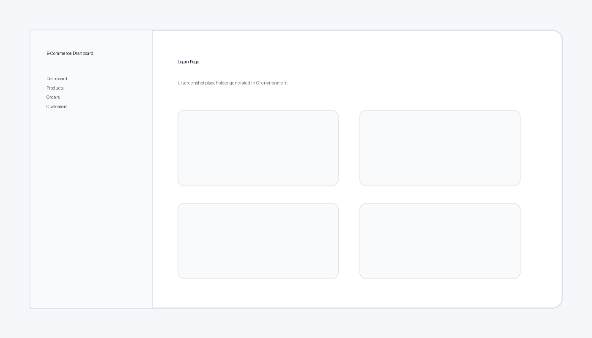

# E-Commerce Analytics Dashboard

Full-stack analytics dashboard with **React 19 + Vite + Chart.js** frontend and **Node.js + Express + PostgreSQL** backend.

## Features

- JWT login (`/api/auth/login`) and current user endpoint (`/api/auth/me`)
- Dashboard analytics charts:
  - Sales over time (last 30 days)
  - Revenue by category
  - Top 5 products
  - Order status distribution
- Products management: CRUD + search/filter/pagination
- Orders management: update flow **Pending → Shipped → Delivered**
- Customers list with order history modal
- Responsive role-based sidebar (`admin` / `customer`)
- Dark/light mode toggle
- Axios API service with JWT interceptors
- Docker Compose stack for frontend, backend, PostgreSQL

## Project Structure

```text
ecommerce-dashboard/
├── backend/
│   ├── src/
│   │   ├── config/
│   │   ├── controllers/
│   │   ├── middleware/
│   │   ├── models/
│   │   ├── routes/
│   │   ├── utils/
│   │   └── app.js
│   ├── Dockerfile
│   ├── package.json
│   └── .env.example
├── frontend/
│   ├── src/
│   │   ├── components/
│   │   ├── pages/
│   │   ├── services/
│   │   ├── context/
│   │   ├── hooks/
│   │   └── App.jsx
│   ├── Dockerfile
│   ├── package.json
│   └── .env.example
├── docker-compose.yml
└── README.md
```

## Screenshots




## Environment Variables

### Root `.env` (for Docker Compose)

Copy `.env.example` to `.env`.

```env
POSTGRES_USER=postgres
POSTGRES_PASSWORD=postgres
POSTGRES_DB=ecommerce_dashboard
JWT_SECRET=super-secret-jwt-key
JWT_EXPIRES_IN=1d
BACKEND_PORT=5000
FRONTEND_PORT=5173
```

### Backend `backend/.env`

Copy `backend/.env.example` to `backend/.env`.

### Frontend `frontend/.env`

Copy `frontend/.env.example` to `frontend/.env`.

## Local Setup (without Docker)

### 1) Backend

```bash
cd backend
npm install
cp .env.example .env
npm run seed
npm run dev
```

### 2) Frontend

```bash
cd frontend
npm install
cp .env.example .env
npm run dev
```

## Docker Setup

```bash
cp .env.example .env
docker compose up --build
```

- Frontend: `http://localhost:5173`
- Backend API: `http://localhost:5000/api`

## API Documentation

### Auth
- `POST /api/auth/login` → returns JWT + user
- `GET /api/auth/me` → returns current user

### Dashboard
- `GET /api/dashboard/stats` → chart aggregates

### Products
- `GET /api/products` → list with `search`, `category`, `page`, `limit`
- `GET /api/products/:id` → product by id
- `POST /api/products` → create product
- `PUT /api/products/:id` → update product
- `DELETE /api/products/:id` → delete product

### Orders
- `GET /api/orders` → list orders (customers see own)
- `POST /api/orders` → create order
- `PUT /api/orders/:id` → update status (`Pending`, `Shipped`, `Delivered`)

### Customers
- `GET /api/customers` → list customers with order counts

## Default Seed Credentials

- Admin: `admin@dashboard.com` / `password123`
- Customers: `customer1@mail.com` … `customer10@mail.com` / `password123`

## Lint / Format

```bash
cd backend && npm run lint
cd frontend && npm run lint
cd backend && npm run format
cd frontend && npm run format
```

## Deploy to Render / Railway

1. Provision a managed PostgreSQL database.
2. Deploy backend service from `backend/`:
   - Build command: `npm install`
   - Start command: `npm run seed && npm run start`
   - Set env vars from `backend/.env.example`
3. Deploy frontend service from `frontend/`:
   - Build command: `npm install && npm run build`
   - Publish directory: `dist`
   - Set `VITE_API_URL` to backend public URL + `/api`
4. Ensure CORS `CLIENT_URL` points to deployed frontend URL.

## Notes

- Backend uses `express-validator` for request validation.
- Passwords are hashed using `bcryptjs`.
- JWT middleware protects private routes and enforces role access.
